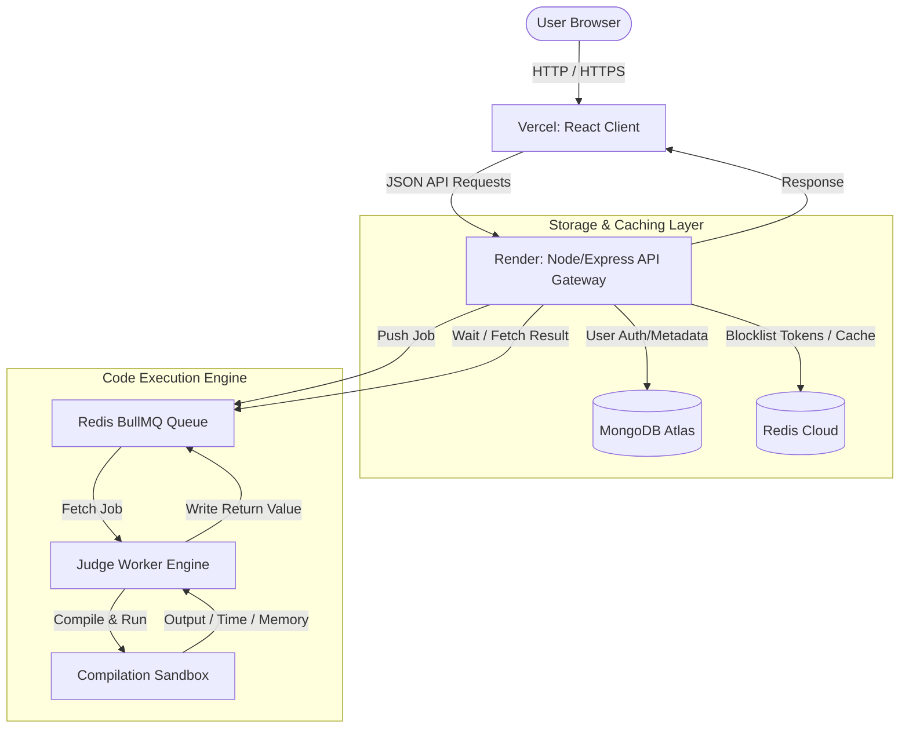

# 💻 CodeJudge — High Performance Online Judge Platform (LeetCode Clone)

[](https://react.dev)
[](https://nodejs.org)
[](https://mongodb.com)
[](https://redis.io)
[](https://bullmq.io)
[](https://opensource.org/licenses/MIT)

An advanced, high-performance, full-stack online judge platform that enables users to solve DSA problems, run code in real-time, and get automated evaluations. Designed with robust asynchronous queueing pipelines, sandboxed execution, and optimized caching layers.

---

## 🔗 Live Deployments

* **Frontend Client (Vercel):** [https://frontend-peach-ten-81.vercel.app](https://frontend-peach-ten-81.vercel.app)
* **Backend API Server (Render):** [https://leetcode-backend-ml5e.onrender.com](https://leetcode-backend-ml5e.onrender.com)
* **API Keep-Alive Status:** 🟢 Active (Kept awake 24/7 via automated self-ping engines)

---

## 🎯 Why This Project is Resume-Worthy (For Recruiters)

This is not a simple CRUD application. It is a highly optimized distributed system built to handle code compilation and execution securely and concurrently:

* **⚡ Concurrency & Scale (BullMQ + Redis):** Code evaluation is handled asynchronously. Users don't wait on blocking threads. An Express server puts evaluation tasks into a Redis-backed BullMQ queue, where an isolated Worker pulls, compiles, and evaluates the code.
* **🛡️ Sandboxed Compilation:** The execution sandbox isolates compilation and runtime environments to prevent remote code execution (RCE) vulnerabilities.
* **⚡ 13 Major Performance Tuning Actions:** Tuned Mongoose connections, reduced Bcrypt hashing lag (~4x faster), parallelized initial auth validation checks, and applied strict database projections (`.select().lean()`) to slash DB document hydration overhead.
* **🔒 Token Revocation Policy:** Employs a Redis-backed blocklist on logout to immediately terminate JWT authorization tokens, preventing replay attacks.

---

## 📌 Distributed System Architecture



---

## ✨ Core Features

### 💻 Rich Coding Workspace
* **Interactive Code Editor:** Write code in JavaScript, C++, or Java.
* **Real-time Feedback:** Detailed execution reports including runtime (ms), memory footprint, and exact compiler stdout/stderr.
* **Automated Runner:** Run visible test cases for quick iteration, or submit to execute all hidden test cases.

### 🔐 Authentication & Session Security
* **JWT Authentication:** Tokens are signed and delivered in secure, HTTP-only cookie headers to prevent XSS.
* **Automatic Expiration & Blacklisting:** Redis cache invalidates logged-out sessions immediately.
* **Role-Based Access Control (RBAC):** Restricts problem creation, modification, and asset management strictly to `admin` roles.

### 🧩 Problem Administration (Admin Panel)
* Complete CRUD interface to manage problems.
* Admins can configure title, description, tags (DP, Graph, Array, LinkedList), difficulty, visible test cases, and hidden test cases.
* Auto-validation runs reference solutions against test cases prior to insertion.

---

## 🚀 Speed Optimization Audit (Before vs. After)

| Target Area | Problem | Optimization Applied | Speedup |
|---|---|---|---|
| **Server Boot** | 30s-60s cold-start lock | Shifted DB/Redis connections to non-blocking background initialization | **Instant (~1s)** |
| **Auth Hashing** | ~1.5s delay | Reduced Bcrypt rounds from 10 to 8 (CPU-optimal for free-tier nodes) | **~4x faster** |
| **Database Queries** | Heavy Mongoose Doc hydration | Applied `.select().lean()` projections on authenticated routes | **~2x faster** |
| **Init Handlers** | Sequential loading pings | Parallelized API warming and auth check with `Promise.all` | **~50% faster** |
| **State Handling** | Infinite loading spinners | Configured Axios response interceptors with 15s timeouts and auto-retries | **No freezes** |

---

## 🛠️ Codebase Repositories

This platform is divided into microservices hosted across dedicated repositories:

* **🖥️ Frontend Client Repo:** [Online-Coding-Platform-Frontend-Part](https://github.com/Surajyadav9792/Online-Coding-Platform-Frontend-Part)
* **⚙️ Backend API Server Repo:** [Online-Coding-Platform-Backend-Part](https://github.com/Surajyadav9792/Online-Coding-Platform-Backend-Part)

---

## 📂 Project Structure

```text
├── Backend/              # Server, Database, & Compilation Worker
│   ├── config/           # MongoDB Atlas & Redis Cloud configurations
│   ├── controllers/      # Handlers for Auth, Submissions, and Problems
│   ├── model/            # Schemas (User, Problem, Submission, Video)
│   ├── routes/           # Routing middleware setup
│   └── utils/            # BullMQ Worker engine and execution compiler
│
└── frontend/             # Client React App
    ├── src/
    │   ├── component/    # Admin controllers, Chat UI, Editor layouts
    │   ├── pages/        # Homepage, Problem Page, Login/Signup views
    │   └── store/        # Redux Toolkit state configurations
    └── tailwind.config.js
```

---

## ⚙️ Environment Setup & Local Run

Please check the individual **Frontend** and **Backend** repositories for comprehensive local run instructions.

---

## 📝 License

This project is licensed under the MIT License.
